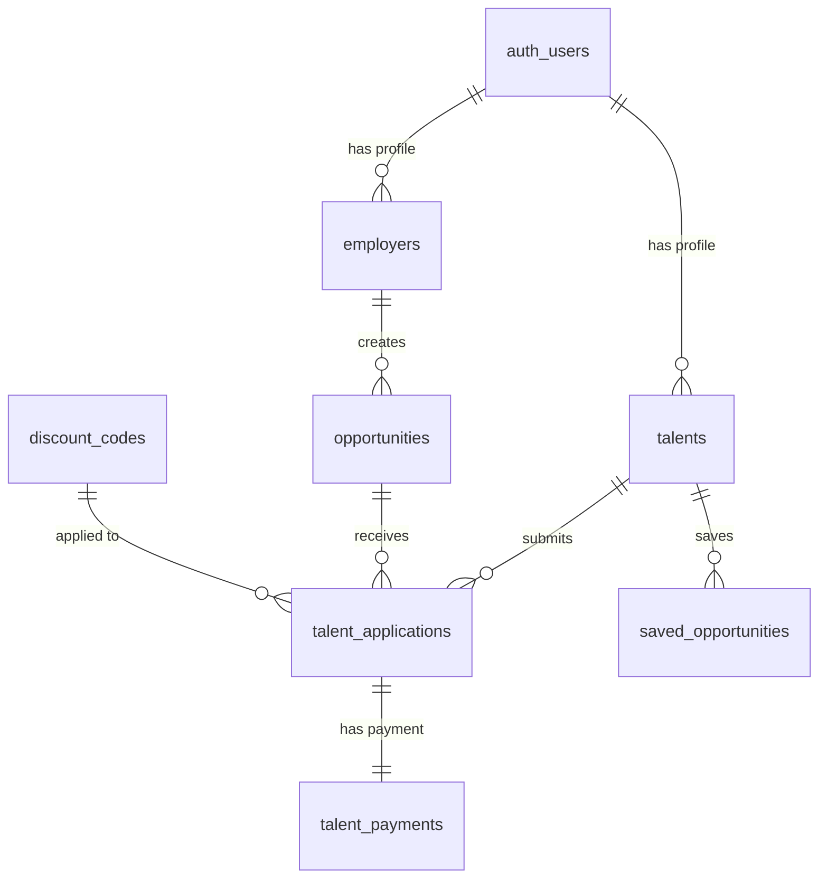
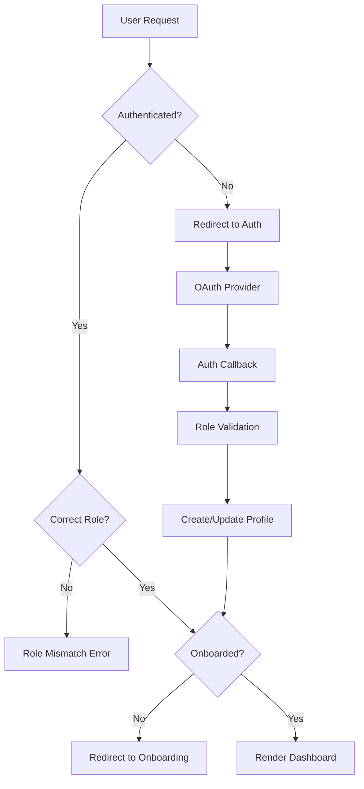
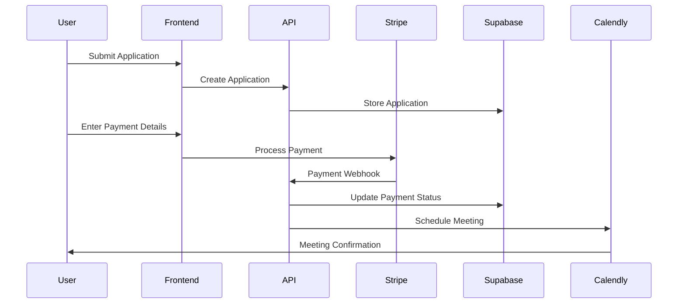
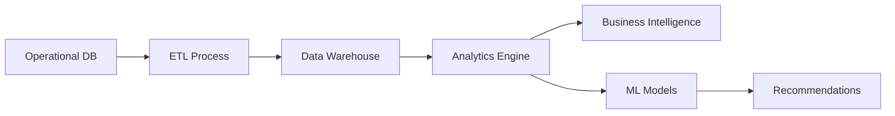

# FTN-Find System Architecture

This document provides a comprehensive overview of the FTN-Find platform architecture, design patterns, and technical decisions.

## 🏗 Architecture Overview

FTN-Find follows a modern, scalable architecture pattern with clear separation of concerns:

```
┌─────────────────┐    ┌─────────────────┐    ┌─────────────────┐
│   Client Apps   │    │   API Gateway   │    │   Services      │
│                 │    │                 │    │                 │
│ • Web App       │◄──►│ • Next.js API   │◄──►│ • Supabase      │
│ • Mobile App    │    │ • Middleware    │    │ • Stripe        │
│ (Future)        │    │ • Auth Layer    │    │ • Calendly      │
└─────────────────┘    └─────────────────┘    └─────────────────┘
```

## 🏛 System Components

### 1. Frontend Layer (Next.js 15)

**Architecture Pattern**: JAMstack (JavaScript, APIs, Markup)

```typescript
// Component Architecture
interface ComponentStructure {
  pages: 'App Router pages with server components';
  features: 'Domain-specific component groups';
  components: 'Shared, reusable UI components';
  contexts: 'Global state management';
  hooks: 'Custom React hooks for business logic';
}
```

**Key Design Patterns**:
- **Compound Components**: Complex UI elements broken into composable parts
- **Custom Hooks**: Business logic abstraction and reusability
- **Context Providers**: Global state management without external libraries
- **Server Components**: Improved performance with server-side rendering

### 2. Authentication Layer (Supabase Auth)

**Multi-Provider Authentication Architecture**:

```typescript
interface AuthFlow {
  providers: ['email', 'google', 'linkedin', 'github'];
  roles: ['talent', 'employer'];
  features: {
    roleBasedRedirect: 'Smart routing based on user role and onboarding status';
    sessionManagement: 'JWT tokens with automatic refresh';
    roleSeparation: 'Prevent cross-role contamination';
  };
}
```

**Authentication State Management**:
```typescript
// AuthContext Provider Pattern
const AuthContext = createContext<AuthContextType>({
  user: User | null,
  session: Session | null,
  authUser: AuthUser | null, // Extended user with role and onboarding status
  isLoading: boolean,
  signOut: () => Promise<void>,
  refreshAuthUser: () => Promise<void>
});
```

### 3. Database Layer (Supabase/PostgreSQL)

**Database Architecture Pattern**: Domain-Driven Design (DDD)

```sql
-- Core Domains
talents/           -- Talent profiles, skills, preferences
employers/         -- Employer profiles, company information
opportunities/     -- Job postings, requirements, benefits
applications/      -- Application tracking, payments, status
matching/          -- AI matching algorithms, scores
payments/          -- Payment processing, discounts, billing
meetings/          -- Scheduling, consultations, calendar integration
```

**Data Relationships**:


### 4. Security Architecture

**Multi-Layer Security Model**:

```typescript
interface SecurityLayers {
  authentication: {
    provider: 'Supabase Auth with JWT tokens';
    mfa: 'Ready for multi-factor authentication';
    sessionManagement: 'Secure cookie-based sessions';
  };
  authorization: {
    rls: 'Row Level Security at database level';
    middleware: 'Route protection with Next.js middleware';
    rbac: 'Role-based access control';
  };
  dataProtection: {
    encryption: 'Encrypted sensitive data at rest';
    validation: 'Input sanitization and validation';
    auditLogs: 'Comprehensive audit trail';
  };
}
```

**Row Level Security (RLS) Implementation**:
```sql
-- Example: Talents can only access their own data
CREATE POLICY talent_own_data ON talents
  FOR ALL USING (user_id = auth.uid());

-- Example: Employers can see applications for their opportunities
CREATE POLICY employer_applications ON talent_applications
  FOR SELECT USING (
    opportunity_id IN (
      SELECT id FROM opportunities WHERE employer_id = auth.uid()
    )
  );
```

## 🔧 Technical Decisions

### 1. Framework Selection

**Next.js 15 Rationale**:
- **App Router**: Modern routing with React Server Components
- **Performance**: Built-in optimization for images, fonts, and scripts
- **Developer Experience**: Excellent TypeScript support and hot reloading
- **Deployment**: Seamless integration with Vercel and other platforms
- **SEO**: Server-side rendering for better search engine optimization

### 2. Database Choice

**Supabase/PostgreSQL Rationale**:
- **Scalability**: PostgreSQL can handle millions of records efficiently
- **Real-time**: Built-in real-time subscriptions for live updates
- **Security**: Row Level Security for fine-grained access control
- **Developer Experience**: Auto-generated APIs and TypeScript types
- **Features**: Built-in authentication, storage, and edge functions

### 3. State Management

**Context API vs External Libraries**:
- **Simplicity**: Avoid additional dependencies for straightforward state needs
- **Performance**: Minimal re-renders with proper context structuring
- **Type Safety**: Full TypeScript integration
- **Server Components**: Compatible with Next.js App Router patterns

### 4. UI Component Strategy

**Shadcn/ui Rationale**:
- **Customization**: Copy-paste components for full control
- **Accessibility**: WCAG-compliant components out of the box
- **Consistency**: Design system approach with Tailwind CSS
- **Maintenance**: No external dependency updates required

## 🔄 Data Flow Architecture

### 1. Application Flow



### 2. Payment Processing Flow



### 3. AI Matching Algorithm

```typescript
interface MatchingAlgorithm {
  inputs: {
    talentProfile: TalentProfile;
    opportunities: Opportunity[];
    preferences: UserPreferences;
  };
  
  processing: {
    skillMatching: 'Weighted skill similarity scoring';
    locationMatching: 'Geographic preference alignment';
    salaryMatching: 'Compensation expectation fitting';
    cultureMatching: 'Company culture and work style fit';
  };
  
  output: {
    matchScore: number; // 0-100 percentage
    reasoning: string[]; // Explanation of match factors
    confidence: number; // Algorithm confidence level
  };
}
```

## 📊 Performance Optimization

### 1. Frontend Optimization

**Strategies Implemented**:
- **Code Splitting**: Automatic route-based code splitting
- **Image Optimization**: Next.js Image component for optimal loading
- **Bundle Analysis**: Webpack Bundle Analyzer for size monitoring
- **Caching**: Browser and CDN caching strategies

**Performance Metrics**:
```typescript
interface PerformanceTargets {
  firstContentfulPaint: '<1.5s';
  largestContentfulPaint: '<2.5s';
  timeToInteractive: '<3s';
  cumulativeLayoutShift: '<0.1';
}
```

### 2. Database Optimization

**Indexing Strategy**:
```sql
-- Search optimization
CREATE INDEX idx_opportunities_search_vector ON opportunities USING GIN(search_vector);

-- Filtering optimization
CREATE INDEX idx_opportunities_compound ON opportunities(industry, location, work_style, is_active);

-- Performance monitoring
CREATE INDEX idx_applications_status_date ON talent_applications(status, applied_at DESC);
```

**Query Optimization**:
- **Pagination**: Cursor-based pagination for large datasets
- **Aggregation**: Materialized views for complex analytics
- **Caching**: Redis caching layer (ready for implementation)

### 3. Monitoring and Observability

**Performance Monitoring**:
```typescript
interface MonitoringStack {
  frontend: {
    metrics: 'Vercel Analytics / Google Analytics';
    errors: 'Sentry Error Tracking';
    performance: 'Core Web Vitals monitoring';
  };
  
  backend: {
    database: 'Supabase metrics and query analysis';
    apis: 'Response time and error rate monitoring';
    infrastructure: 'Server resource utilization';
  };
  
  business: {
    conversions: 'Application completion rates';
    revenue: 'Payment processing metrics';
    engagement: 'User activity and retention';
  };
}
```

## 🚀 Scalability Considerations

### 1. Horizontal Scaling

**Database Scaling**:
- **Read Replicas**: Distribute read queries across multiple instances
- **Sharding**: Partition data by geographic regions or user segments
- **Connection Pooling**: Optimize database connection management

**Application Scaling**:
- **Serverless Functions**: Auto-scaling API endpoints
- **CDN Integration**: Global content delivery for static assets
- **Load Balancing**: Distribute traffic across multiple instances

### 2. Vertical Scaling

**Performance Optimization**:
- **Memory Management**: Efficient React component lifecycle management
- **CPU Optimization**: Optimized algorithms for matching and search
- **Storage Optimization**: Compressed assets and efficient file handling

### 3. Future Architecture Evolution

**Microservices Migration Path**:
```typescript
interface FutureArchitecture {
  services: {
    userService: 'Authentication and profile management';
    matchingService: 'AI-powered job matching algorithms';
    paymentService: 'Payment processing and billing';
    notificationService: 'Email, SMS, and push notifications';
    analyticsService: 'Business intelligence and reporting';
  };
  
  communication: {
    api: 'GraphQL for efficient data fetching';
    events: 'Event-driven architecture with message queues';
    realtime: 'WebSocket connections for live updates';
  };
}
```

## 🔌 Integration Architecture

### 1. Third-Party Integrations

**Current Integrations**:
```typescript
interface Integrations {
  supabase: {
    role: 'Primary backend and database';
    features: ['auth', 'database', 'storage', 'realtime'];
  };
  
  stripe: {
    role: 'Payment processing';
    features: ['cards', 'subscriptions', 'webhooks'];
  };
  
  calendly: {
    role: 'Meeting scheduling';
    features: ['booking', 'webhooks', 'calendar-sync'];
  };
  
  oauth_providers: {
    role: 'Social authentication';
    providers: ['google', 'linkedin', 'github'];
  };
}
```

**Integration Patterns**:
- **Webhook Handling**: Secure webhook validation and processing
- **API Abstraction**: Wrapper services for third-party APIs
- **Fallback Strategies**: Graceful degradation when services are unavailable
- **Rate Limiting**: Respect third-party API limits and quotas

### 2. API Design Principles

**RESTful API Standards**:
```typescript
interface APIStandards {
  routing: {
    pattern: '/api/v1/{resource}/{id?}';
    methods: ['GET', 'POST', 'PATCH', 'DELETE'];
    responses: 'Consistent JSON structure with proper HTTP status codes';
  };
  
  authentication: {
    type: 'Bearer tokens (JWT)';
    validation: 'Middleware-based auth validation';
    authorization: 'Role-based endpoint access';
  };
  
  errorHandling: {
    format: 'Structured error responses';
    logging: 'Comprehensive error logging';
    monitoring: 'Real-time error alerting';
  };
}
```

## 🛡 Security Architecture Deep Dive

### 1. Authentication Security

**Multi-Factor Authentication (Ready)**:
```typescript
interface MFAImplementation {
  factors: {
    knowledge: 'Password or passphrase';
    possession: 'SMS, email, or authenticator app';
    biometric: 'Touch ID, Face ID (mobile app)';
  };
  
  flow: {
    step1: 'Primary authentication';
    step2: 'MFA challenge based on risk assessment';
    step3: 'Session establishment with elevated privileges';
  };
}
```

### 2. Data Protection

**Encryption Strategy**:
```sql
-- Sensitive data encryption at rest
CREATE EXTENSION IF NOT EXISTS pgcrypto;

-- Example: Encrypt PII data
ALTER TABLE talents ADD COLUMN encrypted_phone_number BYTEA;
UPDATE talents SET encrypted_phone_number = pgp_sym_encrypt(phone_number, 'encryption_key');
```

**Privacy Compliance**:
- **GDPR Compliance**: Right to be forgotten, data portability
- **CCPA Compliance**: California Consumer Privacy Act requirements
- **Saudi Data Protection**: Local data protection regulations

### 3. Input Validation and Sanitization

**Validation Strategy**:
```typescript
interface ValidationLayers {
  clientSide: {
    purpose: 'User experience and immediate feedback';
    tools: ['Zod schemas', 'React Hook Form validation'];
  };
  
  serverSide: {
    purpose: 'Security and data integrity';
    tools: ['Supabase RLS', 'Custom validation middleware'];
  };
  
  database: {
    purpose: 'Final data integrity layer';
    tools: ['PostgreSQL constraints', 'Check constraints', 'Triggers'];
  };
}
```

## 📈 Business Logic Architecture

### 1. Domain Models

**Core Business Entities**:
```typescript
// Domain-driven design approach
interface BusinessDomains {
  talent: {
    entities: ['TalentProfile', 'Skills', 'Experience', 'Preferences'];
    valueObjects: ['ContactInfo', 'Location', 'Availability'];
    aggregates: ['TalentApplication', 'JobSearch'];
  };
  
  employer: {
    entities: ['CompanyProfile', 'JobPosting', 'Requirements'];
    valueObjects: ['CompanyInfo', 'Benefits', 'Compensation'];
    aggregates: ['HiringProcess', 'CandidateEvaluation'];
  };
  
  matching: {
    entities: ['MatchScore', 'Recommendation', 'SearchCriteria'];
    services: ['MatchingAlgorithm', 'RankingService'];
  };
}
```

### 2. Business Rules Engine

**Rule Implementation**:
```typescript
interface BusinessRules {
  applicationRules: {
    duplicateApplication: 'Prevent multiple applications to same opportunity';
    timingRestrictions: 'Application deadlines and timing constraints';
    qualificationChecks: 'Minimum requirement validation';
  };
  
  paymentRules: {
    discountValidation: 'Discount code eligibility and limits';
    paymentRetries: 'Failed payment retry logic';
    refundPolicies: 'Automated refund processing rules';
  };
  
  matchingRules: {
    relevanceThreshold: 'Minimum match score for recommendations';
    diversityFactors: 'Ensure diverse recommendation sets';
    freshnessBias: 'Prefer newer opportunities';
  };
}
```

## 🔄 Event-Driven Architecture (Future)

### 1. Event Sourcing Pattern

**Event Store Design**:
```typescript
interface EventSourcing {
  events: {
    TalentRegistered: 'New talent profile created';
    ApplicationSubmitted: 'Job application submitted';
    PaymentProcessed: 'Payment successfully processed';
    MeetingScheduled: 'Consultation meeting booked';
  };
  
  projections: {
    TalentProfile: 'Current state of talent profile';
    ApplicationStatus: 'Current application state';
    PaymentHistory: 'Payment transaction history';
  };
  
  benefits: {
    auditTrail: 'Complete history of all changes';
    eventReplay: 'Ability to rebuild state from events';
    temporalQueries: 'Query state at any point in time';
  };
}
```

### 2. Message Queue Integration

**Asynchronous Processing**:
```typescript
interface MessageQueues {
  emailQueue: {
    purpose: 'Asynchronous email sending';
    events: ['application_received', 'payment_confirmed', 'meeting_scheduled'];
  };
  
  analyticsQueue: {
    purpose: 'Real-time analytics processing';
    events: ['user_action', 'conversion_event', 'error_occurrence'];
  };
  
  integrationQueue: {
    purpose: 'Third-party service integration';
    events: ['calendly_webhook', 'stripe_webhook', 'oauth_callback'];
  };
}
```

## 📊 Analytics and Intelligence

### 1. Data Warehouse Architecture

**Analytics Pipeline**:


### 2. Machine Learning Integration

**ML Services Architecture**:
```typescript
interface MLServices {
  jobMatching: {
    model: 'Collaborative filtering with content-based features';
    features: ['skills', 'experience', 'preferences', 'location'];
    training: 'Continuous learning from user interactions';
  };
  
  salaryPrediction: {
    model: 'Regression model for salary estimation';
    features: ['role', 'experience', 'location', 'industry'];
    accuracy: 'R² > 0.85 for salary predictions';
  };
  
  candidateRanking: {
    model: 'Learning-to-rank for candidate ordering';
    features: ['profile_match', 'availability', 'response_rate'];
    evaluation: 'NDCG@10 metric for ranking quality';
  };
}
```

This architecture documentation serves as a comprehensive guide for understanding, maintaining, and extending the FTN-Find platform. It provides the foundation for scaling the system and making informed technical decisions as the platform grows.

